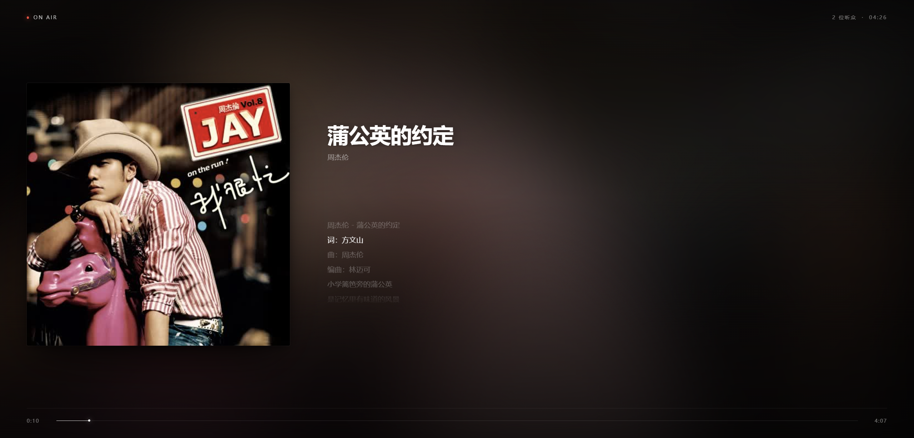

# Kokona-Radio

不间断网页电台。服务器端持续播放音乐，所有听众听到同一段音频，进度完全同步。支持网页播放和 foobar2000 等外部播放器收听



## 特性

- 所有听众进度一致。任何人任何时候接入，听到的都是服务器当前正在播的位置
- 听众离开、刷新、关闭，服务器照常播放，进度不重置
- 使用 `.m3u8`，fb2k / VLC 可直接打开
- 元数据全部来自音频文件标签。标题、艺术家、专辑、封面、歌词都不需要文件命名约定，歌词优先读内嵌字段，回退到同名 `.lrc`
- 控制面板。路径和 token 均可配置，支持上一首 / 下一首、查看待播队列、已播历史、在线听众

## 架构

```
音频文件 --(子 ffmpeg, -re)--> 裸 PCM --(FIFO)--> 主 ffmpeg --(HLS)--> 客户端
                                                    |
                                                    +--> m3u8 + ts 切片
```

- 主 ffmpeg 从命名管道读 PCM，输出 HLS
- 切歌时只更换往 FIFO 写数据的子 ffmpeg。主 ffmpeg 无感，切片序号连续。
- 服务端记录每首歌开始喂给主 ffmpeg 的时刻。`/api/status` 回溯 `streamDelay` 秒返回客户端此刻正在听的内容，使网页 UI 与耳机实际听到的进度对齐。

## 最小配置要求

- 双核CPU

ffmpeg性能开销比较大，性能有限可以尝试进行以下优化(按照优先级从高到低排序)：

- 编辑 server.js：找到'-c:a', 'aac',，将'aac'改为'libmp3lame'
- 编辑 config.json：稍微降低"bitrate"
- 编辑 server.js：在主 ffmpeg 参数里加：'-threads', '1',
- 编辑 config.json：稍微提高"hlsTime"
- 编辑 config.json：将"sampleRate"改成44100，并统一音频文件采样率为44100

## 依赖

- Node.js 18 或更高
- ffmpeg 与 ffprobe

## 目录结构

```
/
├── server.js            # 后端
├── config.json          # 配置文件
├── music/               # 音乐文件，支持子目录
├── hls/                 # 运行时生成的切片
└── public/              # 前端
    ├── index.html
    ├── hls.min.js       # hls音频库
    └── favicon-v1.png   # 自备图标
```

- hls.min.js 用于给浏览器补上 HLS 播放能力，采用 Apache License 2.0 许可证发布，[video-dev/hls.js](https://github.com/video-dev/hls.js)

## 部署

# 克隆

```bash
git clone https://github.com/hsushjk/kokona-radio.git
cd kokona-radio
```

# 配置 config.json ，存放音乐到 music

# 启动后端

```
node server.js
# 或自行用喜欢的方法常驻
```

# Nginx 反代

站点配置里加：

```nginx
location / {
    proxy_pass http://127.0.0.1:3000;
    proxy_http_version 1.1;
    proxy_set_header Host $host;
    proxy_set_header X-Real-IP $remote_addr;
    proxy_set_header X-Forwarded-For $proxy_add_x_forwarded_for;
    proxy_buffering off;
    proxy_cache off;
    proxy_read_timeout 3600s;
    proxy_send_timeout 3600s;
}
```

注意：

- `proxy_buffering off` 必须加。HLS 是流式切片，缓冲会破坏on air体验。
- 如果使用 Cloudflare，请关闭 Rocket Loader 和 Auto Minify（JS / CSS / HTML 全部关掉）。这两项会改写页面内联脚本，可能导致控制面板按钮无响应。建议为 `/ctrl` 路径添加 Page Rule：Cache Level 设为 Bypass，Disable Performance，Disable Apps。本项目已经尽量避免这种情况并尽量兼容

## 配置说明

`config.json`

```json
{
  "port": 3000,
  "musicDir": "/opt/radio/music",
  "hlsDir": "/opt/radio/hls",
  "publicDir": "/opt/radio/public",
  "fifoPath": "/tmp/radio-pcm.fifo",
  "ffmpegPath": "/usr/bin/ffmpeg",
  "ffprobePath": "/usr/bin/ffprobe",
  "bitrate": "192k",
  "sampleRate": 44100,
  "hlsTime": 2,
  "hlsListSize": 6,
  "shuffle": true,
  "streamDelay": 5,
  "controlPath": "ctrl",
  "controlToken": "1234567890passwd"
}
```

| 字段 | 说明 |
|---|---|
| `port` | Node 服务监听端口 |
| `musicDir` | 音乐目录，递归扫描，支持 mp3 / flac / m4a / wav / ogg / opus / aac / wma / aiff / ape |
| `hlsDir` | HLS 切片输出目录，每次启动清空 |
| `publicDir` | 前端静态文件目录 |
| `fifoPath` | PCM 管道路径 |
| `ffmpegPath` / `ffprobePath` | 二进制绝对路径 |
| `bitrate` | AAC 输出码率，建议 128k 至 256k |
| `sampleRate` | 输出采样率 |
| `hlsTime` | 单个切片秒数。越小延迟越低，切片越碎 |
| `hlsListSize` | m3u8 保留的切片数 |
| `shuffle` | 是否每轮打乱曲库 |
| `streamDelay` | UI 对齐补偿，单位秒。见下文 |
| `controlPath` | 控制面板路径。为空则禁用控制功能 |
| `controlToken` | 控制面板 token。至少 16 位。为空则禁用控制功能 |

## 延迟对齐

HLS 固有延迟 = `hlsTime × (客户端缓冲切片数 + 1) + 网络抖动`

`streamDelay`：客户端此刻播放的，是服务器 N 秒前送出去的内容。调整方法：

- UI 落后于音频（音频已到 5 秒，UI 显示 3 秒）：调小 `streamDelay`
- UI 超前于音频（UI 显示 5 秒，音频还在 3 秒）：调大 `streamDelay`

每次改动 1 至 3 秒，重启后等 30 秒再听。两到三轮即可收敛到 ±2 秒内

## 控制面板

配置 `controlPath` 和 `controlToken` 后，访问 `https://example.com/<controlPath>` 打开

面板功能：

- 上一首：从已播历史中弹出最近一首，重新播放
- 下一首：立即切换
- 待播队列：查看接下来 50 首
- 已播历史：查看最近 50 首
- 在线听众：按 sid 或 IP 统计，20 秒无请求掉线

鉴权通过 `X-Ctrl-Token` 请求头传递，使用 `crypto.timingSafeEqual` 比较。token 长度不足 16 位则整个控制功能禁用

`controlPath` 也配置成不易猜测的字符串，避免扫描爆破

## 外部播放器

foobar2000 或 VLC 可直接打开：

```
https://example.com/stream/stream.m3u8
```

ffmpeg 可能需要额外安装组件

注：HLS 协议不携带动态元数据，外部播放器不会显示当前曲目名称和封面，这是协议本身的限制

## 常见问题

### 刚进网页电台的前几秒播放速度微快

客户端正在同步播放进度

### 控制板能打开，但按钮无响应

暂时停用 Cloudflare 的改写优化功能试试

### UI 与声音不同步

调整 `streamDelay`。详见「延迟对齐」一节

### 切歌时出现上一首的声音

说明可能是主 ffmpeg 被重启了。检查日志里是否有 `[main-ffmpeg exit]`。正常情况下主 ffmpeg 生命周期贯穿整个服务运行，只有崩溃才重启

### 在线听众始终显示 1

如果通过 Nginx 反代，`req.socket.remoteAddress` 一直为 `127.0.0.1`，
本项目已从 `X-Forwarded-For` / `X-Real-IP` 读取真实 IP，并优先按前端生成的 sid 统计。若仍为 1，curl检查是否透传了 `X-Forwarded-For`。

### 歌词封面为空

音乐文件不含元数据，标题回退到文件名（不含扩展名），艺术家为空。建议用音乐标签软件整理后再放入，这里推荐 `Lyrico`

### 歌词不显示

FLAC 与 M4A 的内嵌歌词能被 ffprobe 读取。MP3 的 USLT 帧 ffprobe 读不到，需要把歌词存为与音乐文件同名的 `.lrc`，或转换标签
